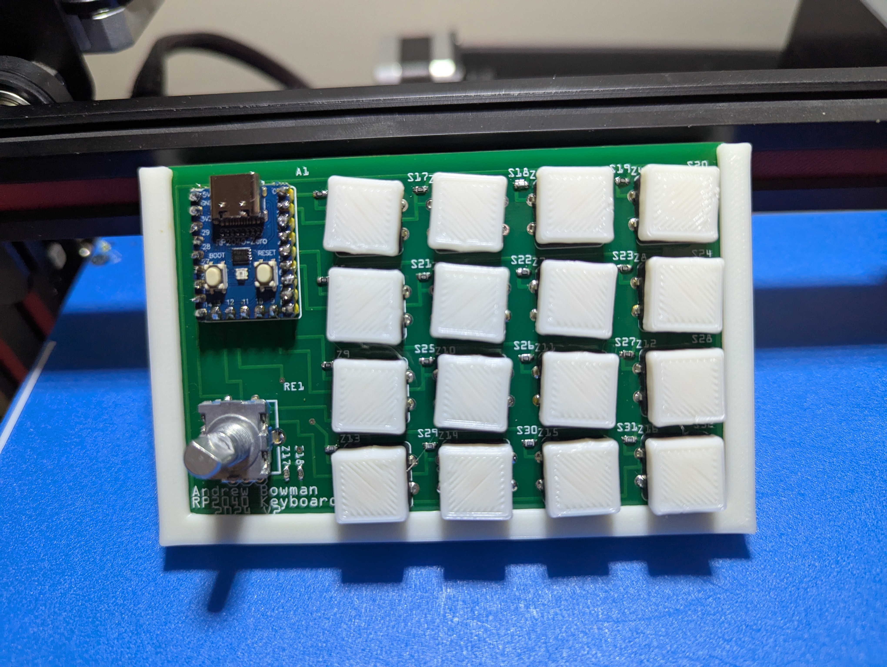
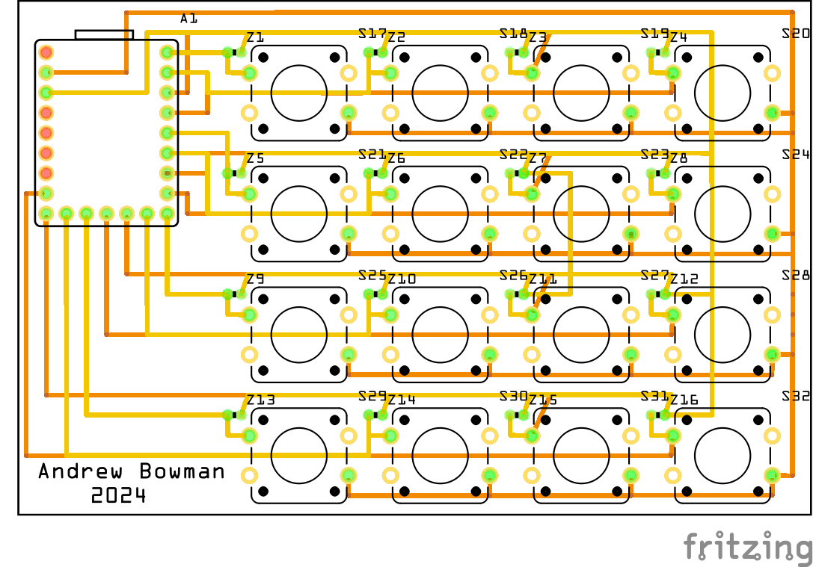
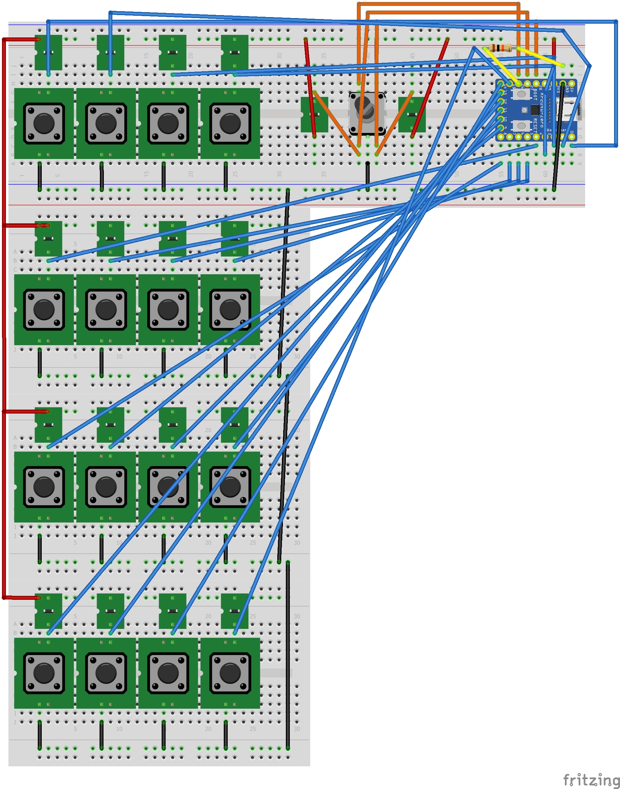
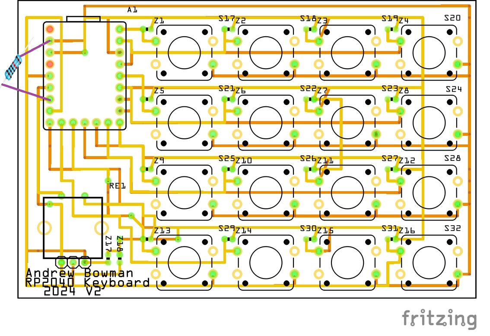

# RP2040-Macro-Keyboard
This is designed to type commonly used text at the press of a button.  For example, if you type "thank you" 20 times a day, you could make that a button.  Working in IT, I can type the same server names or IP addresses multiple times in a span of a few minutes.  This allows me to type those server names at the press of one button.



## About the code
This project is written in Adafruit's Circuit python and relies on the [adafruit_hid library](https://docs.circuitpython.org/projects/hid/en/latest/api.html).  The button actions are defined in a text file called [macros.txt](ButtonsOnly/macros.txt).

## RP2040 Files/Prep
1. [Install Circuit Python on your RP2040](https://learn.adafruit.com/adafruit-feather-rp2040-pico/circuitpython)
2. Copy [lib](lib) to lib on your RP2040
3. Download and edit [macro.txt](ButtonsOnly/macros.txt).  Replace the text after the colon : with what you want each button to type.  The number coresponds to the IO number on the RP2040.
```
   00:text
```
4. Replace the contents of code.py with [PoorManMacros_1.py](ButtonsOnly/PoorManMacros_1.py)
5. If you want to disable the CIRCUITPY USB drive from showing up, add the following to boot.py.  If you need to access the CIRCUITPY drive, slow press the reset button twice.

```
   import storage
   storage.disable_usb_drive()
```


## Parts/Schematic
1x [RP2040](https://www.aliexpress.us/item/3256807710103143.html?spm=a2g0o.order_list.order_list_main.5.27911802MaLXVM&gatewayAdapt=glo2usa) \
16x [1k Resistors](https://www.aliexpress.us/item/3256805478892406.html?spm=a2g0o.order_list.order_list_main.17.27911802MaLXVM&gatewayAdapt=glo2usa) I used 16x 1k Ohm 0603 form factor resistors in my PCB.  If you are designing your own PCB, feel free to use something else. \
16x [12mmx12mm Buttons](https://www.aliexpress.us/item/3256805129033755.html?spm=a2g0o.order_list.order_list_main.10.27911802MaLXVM&gatewayAdapt=glo2usa) \
16x [Button Caps (optional)](/STLs/12x12mm_button.stl) \
1x [PCB Bumper (optional)](/STLs/Bumper.stl) \
Rotary Encoder for Media Control (Optional)\
1x [EC11 Rotary Encoder](https://www.aliexpress.us/item/3256807457768762.html?spm=a2g0o.order_list.order_list_main.5.59f61802S1nYN4&gatewayAdapt=glo2usa) \
2x 10k Ohm 0603 resistors \
1x 10k Ohm through hole resistor




## Rotary Encoder/Media Control

As a second ideration of the design, a rotary encoder was added  to allow media control (pause/play, volume up/down, next/last song).

A 10k Ohm resistor is needed between GND and Pin 26 as shown below for the button to function correctly.

The setup for the buttons is similar to how the macro buttons are defined.  These keys are using the Adafruit Consumer Control library.  Additional functions can be defined as needed.
```
press1:PLAY_PAUSE
doublepress:MUTE
right1:VOLUME_INCREMENT
left1:VOLUME_DECREMENT
pressright:SCAN_NEXT_TRACK
pressleft:SCAN_PREVIOUS_TRACK
```






