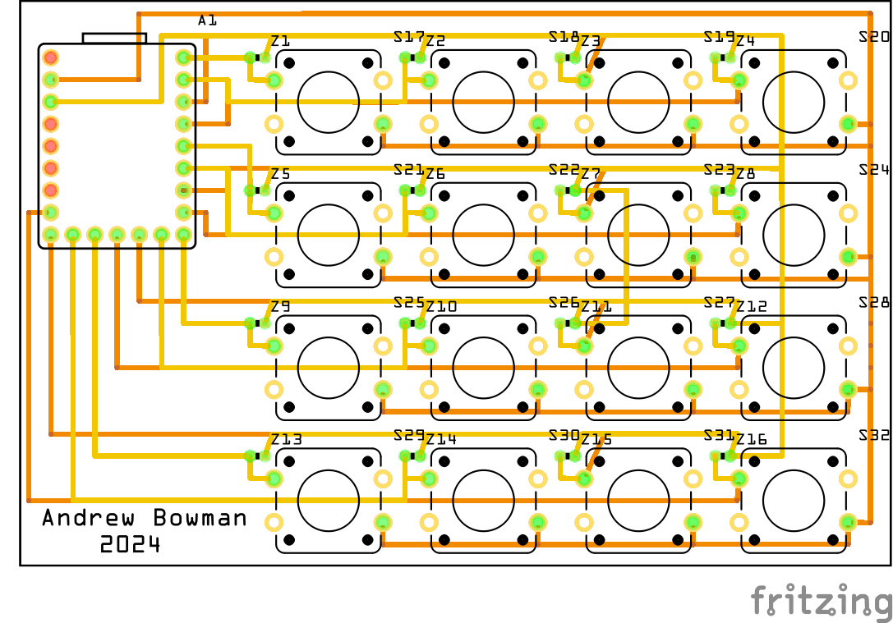

# RP2040-Macro-Keyboard
This is designed to type commonly used text at the press of a button.  For example, if you type "thank you" 20 times a day, you could make that a button.  Working in IT, I can type the same server names or IP addresses multiple times in a span of a few minutes.  This allows me to type those server names at the press of one button.

## RP2040 Files/Prep
1. [Install Circuit Python on your RP2040](https://learn.adafruit.com/adafruit-feather-rp2040-pico/circuitpython)
2. Copy [lib](lib) to lib on your RP2040
3. Download and edit [macro.txt](macro.txt).  Replace the text after the colon : with what you want each button to type.  The number coresponds to the IO number on the RP2040.

   00:text

4. Replace the contents of code.py with [PoorManMacros_1.py](PoorManMacros_1.py)
5. If you want to disable the CIRCUITPY USB drive from showing up, add the following to boot.py.  If you need to access the CIRCUITPY drive, slow press the reset button twice.

   import storage
   storage.disable_usb_drive()

## Parts/Schematic
1x [RP2040](https://www.aliexpress.us/item/3256807710103143.html?spm=a2g0o.order_list.order_list_main.5.27911802MaLXVM&gatewayAdapt=glo2usa) \
16x [1k Resistors](https://www.aliexpress.us/item/3256805478892406.html?spm=a2g0o.order_list.order_list_main.17.27911802MaLXVM&gatewayAdapt=glo2usa) I used 16x 1k Ohm 0603 form factor resistors in my PCB.  If you are designing your own PCB, feel free to use something else. \
16x [12mmx12mm Buttons](https://www.aliexpress.us/item/3256805129033755.html?spm=a2g0o.order_list.order_list_main.10.27911802MaLXVM&gatewayAdapt=glo2usa)

